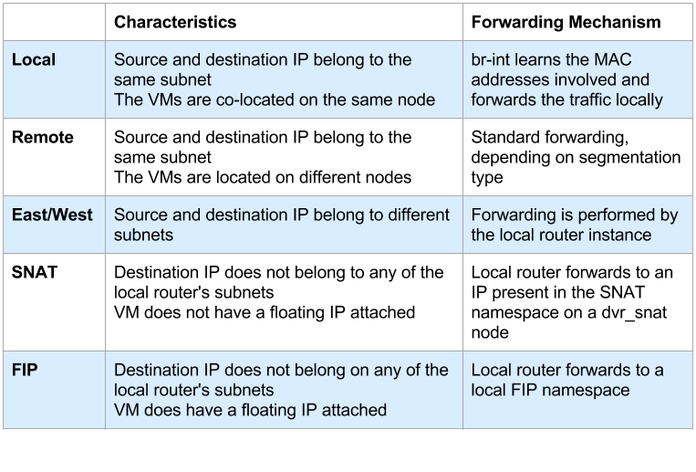

# 分布式虚拟路由 - 浮动IP
> 翻译自[Distributed Virtual Routing – Floating IPs](https://assafmuller.com/2015/04/15/distributed-virtual-routing-floating-ips/)  

**当前位置**   
[概述与东、西流量](distributed-virtual-routing-overview-and-eastwest-routing.md)  
[SNAT](distributed-virtual-routing-snat.md)  
\* 浮动IP

## 过去的美好时光里…
传统路由器通过在路由器命名空间内的虚拟机的固定IP与它的浮动IP之间执行1：1的NAT来提供浮动IP连接能力。额外的，L3代理在路由器的外部设备上配置浮动IP的时候会抛出一个免费ARP（Gratuitous ARP）。这样做是为了向外部网络通告可以通过路由器的外部设备的MAC地址来访问浮动IP。浮动IP在路由器的外部设备上被配置为/32的前缀，因此路由器会应答这些地址的所有请求。

## 事情将变得奇怪
然而，在DVR的世界里，事情将会非常不同。整个事情将会迅速变得复杂，所以让我们了解一下怎样以及为什么那样做。我们本可以保持现状，并在路由器的“qg”设备上配置浮动IP。或者说我们还有别的办法？让我们考虑一下：
- MAC地址！网络工程师竭尽全力使广播域最小化，因为网络设备的MAC表具有相当适度的上限。大多数外部网络使用Flat网络或VLAN网络：可以通过使用多个外部网络或单个外部网络上的多个子网来对其进行细分，但是出于讨论的目的，我们考虑使用单个外部网络。在传统路由器中，您可以每个路由器都在外部网络上“消耗”一个MAC地址。如果我们保留现有模型但是使用分布式路由器，那么对于每个（结点，路由器）对我们都将消耗一个MAC地址。这会迅速扩大广播域。这不太好！
- IP地址！传统路由器在其外部设备上配置可路由地址，而后者绝对不会被浪费，因为它被用于SNAT流量。正如我们在上一篇博客文章中所注意到的，使用DVR我们一样可以这么做。那么，实际上我们是否需要每个计算结点上都有一个独立的路由器IP？实际上我们不需要，至少不是为了浮动IP NAT的目的。你可能需要一个独立IP用于故障排除，但是对于NAT而言，不需要。作为替代，我们为每一个（结点，外部网络）对分配一个独立的IP地址。  

## 最后的结果
让我们继续前进，看看连接是怎么进行的（在计算结点上）：
  
当一个浮动IP被分配到一个虚拟机，L3代理会为浮动IP所属的外部网络创建一个浮动IP（FIP）命名空间（如果不存在的话）：
```
[stack@vpn-6-21 devstack (master=)]$ ip netns
fip-cef4f7b4-c344-4904-a847-a9960f58fb20
qrouter-ef25020f-012c-41d6-a36e-f2f09cb8ea62
```
我们可以看到，fip命名空间的名字是由它代表的外部网络的ID决定的：
```
[stack@vpn-6-21 devstack (master=)]$ neutron net-show public
...
| id                        | cef4f7b4-c344-4904-a847-a9960f58fb20 |
...
```
计算结点上的每个路由器都通过veth对连接到FIP命名空间（提醒：veth对是由一对设备表示的一种Linux网络设备。无论从哪一端进入，都将从另一端离开veth对。该对每一端都可以配置自己的IP地址。veth对通常用于命名空间之间的互联，因为veth对的每一端都可以放在你选择的名称空间中。）

veth对的“rfp”或者叫“指向FIP的路由器”端位于路由器命名空间中：
```
[stack@vpn-6-21 devstack (master=)]$ sudo ip netns exec qrouter-ef25020f-012c-41d6-a36e-f2f09cb8ea62 ip address
    ...
3: rfp-ef25020f-0: <BROADCAST,MULTICAST,UP,LOWER_UP> mtu 1500 qdisc pfifo_fast state UP group default qlen 1000
    link/ether 16:91:f5:0b:34:50 brd ff:ff:ff:ff:ff:ff
    inet 169.254.31.28/31 scope global rfp-ef25020f-0
    inet 192.168.1.3/32 brd 192.168.1.3 scope global rfp-ef25020f-0
    ...
52: qr-369f59a5-2c: <BROADCAST,MULTICAST,UP,LOWER_UP> mtu 1500 qdisc noqueue state UNKNOWN group default 
    link/ether fa:16:3e:33:6d:d7 brd ff:ff:ff:ff:ff:ff
    inet 20.0.0.1/24 brd 20.0.0.255 scope global qr-369f59a5-2c
    ...
53: qr-c2e43983-5c: <BROADCAST,MULTICAST,UP,LOWER_UP> mtu 1500 qdisc noqueue state UNKNOWN group default 
    link/ether fa:16:3e:df:74:6c brd ff:ff:ff:ff:ff:ff
    inet 10.0.0.1/24 brd 10.0.0.255 scope global qr-c2e43983-5c
    ...
```
而veth对的“fpr”或者叫“指向路由器的FIP”端和“fg”/外部设备一同存在于FIP命名空间：
```
[stack@vpn-6-21 devstack (master=)]$ sudo ip netns exec fip-cef4f7b4-c344-4904-a847-a9960f58fb20 ip a
1: lo: <LOOPBACK,UP,LOWER_UP> mtu 65536 qdisc noqueue state UNKNOWN group default 
    ...
3: fpr-ef25020f-0: <BROADCAST,MULTICAST,UP,LOWER_UP> mtu 1500 qdisc pfifo_fast state UP group default qlen 1000
    link/ether 3e:d3:e7:34:f6:f3 brd ff:ff:ff:ff:ff:ff
    inet 169.254.31.29/31 scope global fpr-ef25020f-0
    ...
59: fg-b2b77eed-1b: <BROADCAST,MULTICAST,UP,LOWER_UP> mtu 1500 qdisc noqueue state UNKNOWN group default 
    link/ether fa:16:3e:cc:98:c8 brd ff:ff:ff:ff:ff:ff
    inet 192.168.1.23/24 brd 192.168.1.255 scope global fg-b2b77eed-1b
    ...
```
如你所知，rfp和fpr配置有链路本地IP地址（link-local IP addresses）。每次在计算结点上配置路由器并将其连接到FIP名称空间时（如果在该路由器上配置了浮动IP），就会从169.254.x.y大型IP地址池中分配一对空闲IP地址。为了以防代理或结点决定执行没某些不可思议的操作并且重启的万一，这些这些分配将被持久保存在结点的磁盘上。

在追踪一个离开虚拟机的数据包之前，让我们先观察一下路由器命名空间中的路由规则：
```
[stack@vpn-6-21 devstack (master=)]$ sudo ip netns exec qrouter-ef25020f-012c-41d6-a36e-f2f09cb8ea62 ip rule
0:	from all lookup local 
32766:	from all lookup main 
32767:	from all lookup default 
32768:	from 10.0.0.4 lookup 16 
167772161:	from 10.0.0.1/24 lookup 167772161 
335544321:	from 20.0.0.1/24 lookup 335544321
```
太棒了，一个新的源路由规则！这一次，这是虚拟机的固定IP地址的一个特定规则。你会注意到，它的优先级比其后的通用规则低（更好）。稍后我们将对此进一步讨论。

## 跟踪一个数据包
在上一篇博客文章中，我们讨论了对东、西流量和SNAT流量进行分类并进行适当转发的问题。现在，我们加入了第三类流量：浮动IP流量。SNAT和浮动IP流量通过上面显示的ip规则进行区分。每当L3代理配置浮动IP时，它都会添加一个特定于该IP的规则：将VM的固定IP添加到rules表和一个新的路由表（在本示例中为“16”）：
```
[stack@vpn-6-21 devstack (master=)]$ sudo ip netns exec qrouter-ef25020f-012c-41d6-a36e-f2f09cb8ea62 ip route show table 16
default via 169.254.31.29 dev rfp-ef25020f-0
```
如果虚拟机10.0.0.4（具有浮动IP 192.168.1.3）向外部网络发送流量，它会先到达本地qrouter命名空间，然后将像以前的博客文章中的SNAT示例一样查询ip规则。主路由表没有默认路由，并且匹配了“32768：from 10.0.0.4 lookup 16”规则。称为“16”的路由表只有一个条目，即默认路由，下一跳为169.254.31.29。qrouter iptables NAT规则适用，并且源IP被替换为192.168.1.3。然后，这个消息连带有169.254.31.29的MAC地址通过rfp设备被转发，并使用其“fpr”设备直接进入FIP名称空间。FIP命名空间路由表具有默认路由，并且数据包通过“fg”设备离开。

<iframe src="https://docs.google.com/presentation/d/1J0GYCzhMWAskf4W2HjmoSjJMt-zekpquiM8AzZtGMSk/embed?start=false&#038;loop=false&#038;delayms=10000" frameborder="0" width="696" height="569" marginheight="0" marginwidth="0" allowfullscreen="true" mozallowfullscreen="true" webkitallowfullscreen="true"></iframe>

相反的方向是相似的，但是有一个陷阱。外界如何知道虚拟机的浮动IP地址：192.168.1.3？实际上，fip命名空间如何知道它在哪里？它在该子网中有一个IP地址，但该地址本身距离qrouter名称空间有一个跳数的距离。为解决这两个问题，在FIP名称空间的“fg”设备上启用了代理ARP。这意味着FIP名称空间将回答ARP请求，后者请求了存在于FIP命名空间自己的接口上的IP地址以及它自己知道如何路由到的地址。为此，每个浮动IP都配置了一条从FIP命名空间返回路由器命名空间的路由，如下所示：
```
[stack@vpn-6-21 devstack (master=)]$ sudo ip netns exec fip-cef4f7b4-c344-4904-a847-a9960f58fb20 ip route
default via 192.168.1.1 dev fg-b2b77eed-1b 
169.254.31.28/31 dev fpr-ef25020f-0  proto kernel  scope link  src 169.254.31.29 
192.168.1.0/24 dev fg-b2b77eed-1b  proto kernel  scope link  src 192.168.1.23 
192.168.1.3 via 169.254.31.28 dev fpr-ef25020f-0 
```
当外界想要联系虚拟机的浮动IP时，FIP命名空间将通过fg的设备MAC地址回复192.168.1.3可用（这是一个谎言，但确实有用的谎言…这就是代理的命运）。流量将通过连接到br-ex的网卡转发到计算机，再转发到FIP的命名空间“ fg”设备。FIP名称空间将使用其到192.168.1.3的路由，并将其路由到其veth设备。该消息将由qrouter命名空间接收：192.168.1.3在其rfp设备上进行了配置，其iptables规则将使虚拟机的固定IP 10.0.0.4替换数据包的目标IP，并将消息传递给虚拟机。也许是为了让这个工作变得更加迷惑，就像传统路由器一样，免费ARP（Gratuitous ARP）被发送。但是，在这里，浮动IP实际上并未在“fg”设备上进行配置。这就是在发送免费ARP之前立即对其进行临时配置，然后立即将其删除的原因。  

## 分类摘要
  
