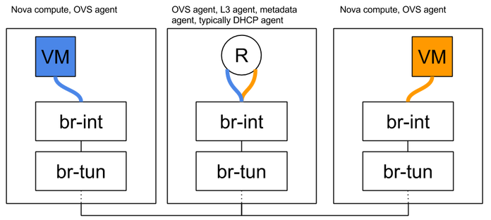
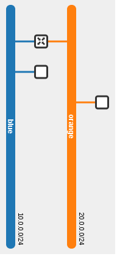
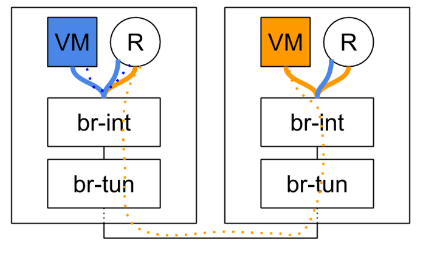
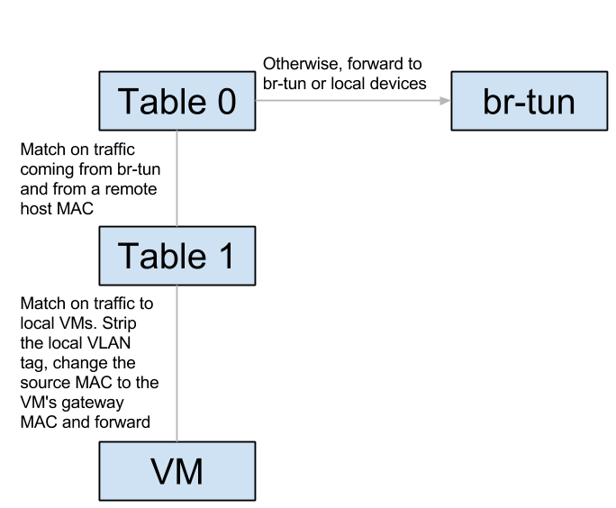
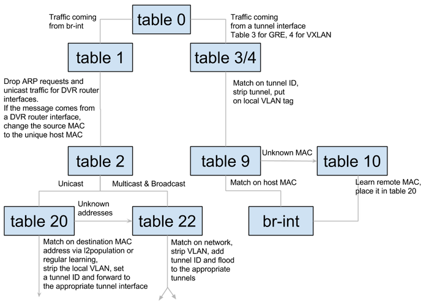

# 分布式虚拟路由 - 概述与东、西路由
> 翻译自[Distributed Virtual Routing – Overview and East/West Routing | Assaf Muller](https://assafmuller.com/2015/04/15/distributed-virtual-routing-overview-and-eastwest-routing/)  

**当前位置**   
\* 概述与东、西流量  
SNAT  
浮动IP

## 传统路由


## 概述
分布式虚拟路由（Distributed Virtual Routing，DVR）旨在利用移动大多数此前在网络结点上进行的路由操作至计算结点来移除上图中的中心L3代理，从而将传统网络结点的故障域孤立，同时优化网络流量。  
- 东、西流量（同一租户中不同网络之间的流量，例如你的应用的不同层之间的流量）此前全部通过你的一个网络结点，而当使用DVR时，这些流量都将绕过网络结点，直接在托管虚拟机的计算结点之间传输。
- 具有浮动IP的南、北流量（从外部网络到使用浮动IP的虚拟机的流量，或者相反的流量），不会通过网络结点，但是会被直接路由到托管虚拟机的计算结点。DVR会认定你的计算结点和外部网络直接相连。
- 不具有浮动IP的南、北流量仍然会路由到并经过网络结点（分布式SNAT带来了另一些挑战）。  
这些流量类别的每一个都会引入一些特定的复杂问题，这些将在单独的博客文章中提及。以下章节描述了需求，而[此前的文章](https://assafmuller.com/2015/04/06/multinode-dvr-devstack/)列出了需要的改变的设置。

## 需要的知识
- 特定的章节需要OVS流（OVS OpenFlow）和隧道（tunneling）相关的知识，你可以从[这篇文章](https://assafmuller.com/category/overlays/)学习（从下往上看）。
- 传统路由器（不是分布式也不是高可用性的路由）如何工作
  - [概述](https://developer.rackspace.com/blog/neutron-networking-l3-agent/)
  - [错误解决](https://www.mirantis.com/blog/identifying-and-troubleshooting-neutron-namespaces/)

## 部署需求
- ML2插件（ML2 plugin）
- 启用L2pop机制驱动（L2pop mechanism driver）
- 启用openvswitch机制驱动（openvswitch mechanism driver），并在所有计算结点安装OVS代理（OVS agent）
- 外部网络连接到每一个独立的计算结点
- Juno版本需要隧道租户网络：VXLAN或GRE
- Kilo版本引入了对VLAN租户网络的支持

## 东、西路由
逻辑拓扑图：  
  
物理拓扑图：  
  
在这个例子中，蓝色的虚拟机ping了橙色的虚拟机。如虚线所示，路由在源主机中进行。出现在两个计算结点上的是同一个路由器。
```
neutron router-list
+--------------------------------------+-------------+-----------------------+-------------+-------+
| id                                   | name        | external_gateway_info | distributed | ha    |
+--------------------------------------+-------------+-----------------------+-------------+-------+
| 44015de0-f772-4af9-a47f-5a057b28fd72 | distributed | null                  | True        | False |
+--------------------------------------+-------------+-----------------------+-------------+-------+
```  
我们可以看到，同一个路由器存在于两个不同的计算结点上：
```
[stack@vpn-6-21 devstack (master=)]$ neutron l3-agent-list-hosting-router distributed
+--------------------------------------+-------------------------+----------------+-------+----------+
| id                                   | host                    | admin_state_up | alive | ha_state |
+--------------------------------------+-------------------------+----------------+-------+----------+
| 6aaeb8a4-b393-4d08-96d2-e66be23216c1 | vpn-6-23.tlv.redhat.com | True           | :-)   |          |
| e8b033c5-b515-4a95-a5ca-dbc919b739ef | vpn-6-21.tlv.redhat.com | True           | :-)   |          |
+--------------------------------------+-------------------------+----------------+-------+----------+
```  
两个结点上都创建了同一个路由器的命名空间（router namespace），它们具有相同的接口、MAC地址与IP地址：
```
[stack@vpn-6-21 devstack (master=)]$ ip netns
qrouter-44015de0-f772-4af9-a47f-5a057b28fd72

[stack@vpn-6-21 devstack (master=)]$ sudo ip netns exec qrouter-44015de0-f772-4af9-a47f-5a057b28fd72 ip address
1: lo: <LOOPBACK,UP,LOWER_UP> mtu 65536 qdisc noqueue state UNKNOWN group default 
    ...
70: qr-c7fa2d36-3d: <BROADCAST,MULTICAST,UP,LOWER_UP> mtu 1500 qdisc noqueue state UNKNOWN group default 
    link/ether fa:16:3e:3c:74:9c brd ff:ff:ff:ff:ff:ff
    inet 10.0.0.1/24 brd 10.0.0.255 scope global qr-c7fa2d36-3d
    ...
71: qr-a3bc956c-25: <BROADCAST,MULTICAST,UP,LOWER_UP> mtu 1500 qdisc noqueue state UNKNOWN group default 
    link/ether fa:16:3e:a3:3b:39 brd ff:ff:ff:ff:ff:ff
    inet 20.0.0.1/24 brd 20.0.0.255 scope global qr-a3bc956c-25
    ...
```
```
[stack@vpn-6-23 devstack (master=)]$ ip netns
qrouter-44015de0-f772-4af9-a47f-5a057b28fd72

[stack@vpn-6-23 devstack (master=)]$ sudo ip netns exec qrouter-44015de0-f772-4af9-a47f-5a057b28fd72 ip address
1: lo: <LOOPBACK,UP,LOWER_UP> mtu 65536 qdisc noqueue state UNKNOWN group default 
    ...
68: qr-c7fa2d36-3d: <BROADCAST,MULTICAST,UP,LOWER_UP> mtu 1500 qdisc noqueue state UNKNOWN group default 
    link/ether fa:16:3e:3c:74:9c brd ff:ff:ff:ff:ff:ff
    inet 10.0.0.1/24 brd 10.0.0.255 scope global qr-c7fa2d36-3d
    ...
69: qr-a3bc956c-25: <BROADCAST,MULTICAST,UP,LOWER_UP> mtu 1500 qdisc noqueue state UNKNOWN group default 
    link/ether fa:16:3e:a3:3b:39 brd ff:ff:ff:ff:ff:ff
    inet 20.0.0.1/24 brd 20.0.0.255 scope global qr-a3bc956c-25
    ...
```
## 路由器生命周期
为了东、西流量通信，我们将很开心的忽略分布式路由器的SNAT与集中式部分。由于DVR路由器是在计算结点上生成的，并且部署中可能包含大量的DVR路由器，因此仅在有意义的地方和位置创建和优化DVR路由器实例就变得很重要。
- 当DVR路由器连接到子网时，这个路由器会被安排到负责该子网中所有承载端口的计算结点上（包括DHCP、负载均衡（Load balance, LB）和虚拟机端口）。
  - 在计算结点上的L3代理会收到一个通知并配置路由器
  - OVS代理会连接到分布式路由器的端口并配置它的流
- 当一个虚拟机（被连接到由DVR路由器服务的子网上）生成且这个路由器的计算结点尚未配置这个DVR路由器，那么这个路由器将被安排到这个结点上。

## 主机MAC地址  
在跟踪从一个虚拟机到另一个虚拟机的数据包之前，让我们来描述一个由分布式端口的特性所引发的问题。正如我们在上面看到的IP地址的输出结果一样，DVR路由器的副本被安排到负责所有相关的计算结点。这意味着在这个网络的多个地方，都存在完全相同的的接口（包括MAC地址与IP地址！）。[如果不做一些特殊的预防措施，这可能会导致灾难性的后果。](https://i.imgur.com/7pnHbwP.jpg)
- 当使用VLAN租户网络时，底层硬件交换机会从不同的端口一遍遍重新学习路由器的内部设备的MAC地址。这回导致一些问题，具体取决于交换机以及它如何配置（有一些管理员会启用[安全措施](http://www.ciscopress.com/articles/article.asp?p=1722561)，通过关闭有问题的端口来禁用从其他端口学习MAC地址的功能）。一般而言，有一个最基本的假设是：一个MAC地址只能在一个网络中的一个地方出现一次。
- 无论网络分段类别如何，给定计算结点上的虚拟交换机都会意识到MAC地址同时存在于本地和远程，从而产生与硬件底层交换机类似的效果。 


我们选择的解决方法是，为每个计算结点分配一个独特的MAC地址。当一个启用DVR的OVS代理启动时，它会通过一个新的RPC消息从服务器请求它的MAC地址。如果已经存在一个分配给它的MAC地址，那么该地址将被返回，否则的话将生成一个新的地址，并存放在数据库的一个新的主机-MAC地址表中，并将该地址返回给OVS代理。  
```
MariaDB [neutron]> select * from dvr_host_macs;
+-------------------------+-------------------+
| host                    | mac_address       |
+-------------------------+-------------------+
| vpn-6-21.tlv.redhat.com | fa:16:3f:09:34:f2 |
| vpn-6-23.tlv.redhat.com | fa:16:3f:4e:4f:98 |
| vpn-6-22.tlv.redhat.com | fa:16:3f:64:a0:74 |
+-------------------------+-------------------+
```
每当来自DVR路由器的流量离开时，这个地址都将被使用。通过OVS流，DVR接口的源MAC地址将被主机MAC地址替换。至于相反的情形，我们假定你最多只将一个路由器连接到一个子网（这实际上是一个错误的假设，因为API允许你将多个路由器连接到一个子网上）。当流量进入一个计算结点，且它与本地虚拟机的MAC地址以及其网络的分段ID相匹配时，源MAC地址会从远程计算机的主机MAC地址替换为该虚拟机的网关MAC地址。  
## 流（Flows）
br-int:
  
br-tun:
  
让我们跟踪从蓝色子网上的蓝色本地虚拟机到橙色子网上的橙色远程虚拟机的单播流量。流量首先会通过br-int从蓝色虚拟机转发到它的本地网关，然后到达路由器命名空间（router namespace）。这个路由器将路由到远程虚拟机的橙色子网，并将源MAC地址有效地替换成它的橙色接口，同时将目的MAC地址替换为橙色虚拟机的MAC地址（路由器怎么知道这个MAC地址的？下一段会有更多了解）。然后，它将数据包发回br-int，后者将数据包再次转发给br-tun。到达br-tun的表0后，流量将被分类为来自br-int的流量，并被重定向到表1。此时的源MAC地址是路由器的橙色MAC地址，且因此将被改成本地主机的MAC地址并重定向到表2。数据被分类为单播流量并被重定向到表20，在这里L2pop插入了一个远程虚拟机橙色MAC地址的流，流量通过具有相关隧道ID的合适的隧道发送出去。


当流量到达远程主机后，它将被转发给br-tun，后者将流量重定向到表4（假定是VXLAN）。匹配隧道ID后，本地VLAN标记将被附加（这样，当流量到达br-int时就可以匹配正确的网络）。在表9中，第一个主机的主机MAC地址被匹配，流量被转发给br-int。在br-int中，流量被重定向到表1，因为它与第一个主机的源MAC地址匹配。最后，本地VLAN标记被剥离，源MAC地址再一次被改变来匹配路由器的橙色MAC地址，流量将被转发到橘黄色的虚拟主机。成功了！  

<iframe src="https://docs.google.com/presentation/d/1KKdXP2w0gjqu1aE3D4zl3-0-QRARyVjVkDKgXeH7kOw/embed?start=false&amp;loop=false&amp;delayms=10000" marginheight="0" marginwidth="0" allowfullscreen="true" mozallowfullscreen="true" webkitallowfullscreen="true" width="696" height="569" frameborder="0"></iframe>

## ARP
让我们观察一下第一个结点的路由器的ARP表：
```
[stack@vpn-6-21 devstack (master=)]$ sudo ip netns exec qrouter-44015de0-f772-4af9-a47f-5a057b28fd72 ip neighbor
10.0.0.11 dev qr-c7fa2d36-3d lladdr fa:16:3e:19:63:25 PERMANENT
20.0.0.22 dev qr-a3bc956c-25 lladdr fa:16:3e:7d:49:80 PERMANENT
```   
永久、静态记录，这很令人好奇…为什么会变成这样？事实证明，配置DVR路由器的部分过程是为接口的子网上的每一个端口填充静态ARP条目的过程。只要将新的路由器安排到一个L3代理，或者一个新的接口被添加到现有路由器，这个过程就会发生。每个相关的L3代理都会收到通知，并且在把接口添加到路由器（或者配置新的路由器）时，会通过新的RPC方法来请求接口的子网上的所有端口。然后，它会为每一个端口添加新的静态ARP条目。每当创建一个新的端口，或者更改现有未绑定端口的MAC地址时，所有托管DVR路由器，并与这个端口的子网相连接的L3代理，都会被另一种新的RPC方法通知，同时，一个ARP条目会被添加到或者从相关路由器删除。  

## 参考资料
- [Blueprint](https://blueprints.launchpad.net/neutron/+spec/neutron-ovs-dvr)
- [Spec](http://specs.openstack.org/openstack/neutron-specs/specs/juno/neutron-ovs-dvr.html)
- [Wiki document](https://wiki.openstack.org/wiki/Neutron/DVR)
- [Design document](https://docs.google.com/document/d/1iXMAyVMf42FTahExmGdYNGOBFyeA4e74sAO3pvr_RjA/edit)
- [L2 design document](https://docs.google.com/document/d/1depasJSnGZPOnRLxEC_PYsVLcGVFXZLqP52RFTe21BE)
- [L3 design document](https://docs.google.com/document/d/1jCmraZGirmXq5V1MtRqhjdZCbUfiwBhRkUjDXGt5QUQ/)
