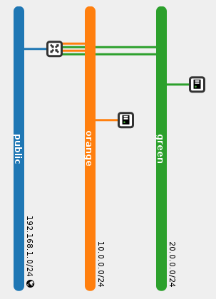
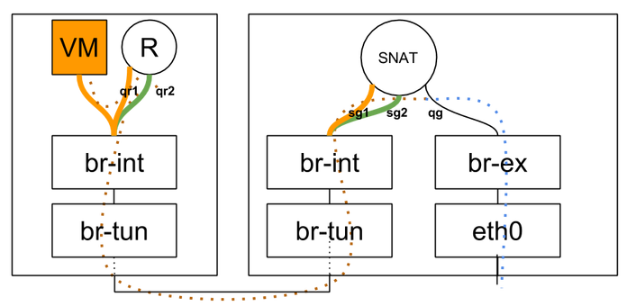

# 分布式虚拟路由 - SNAT
> 翻译自[Distributed Virtual Routing – SNAT | Assaf Muller](https://assafmuller.com/2015/04/15/distributed-virtual-routing-snat/)  

**当前位置**   
[概述与东、西流量](distributed-virtual-routing-overview-and-eastwest-routing.md)  
\* SNAT  
[浮动IP](distributed-virtual-routing-floating-ips.md)

## SNAT与浮动IP
关于在Neutron中使用的两种NAT模式的快速比较  
1. SNAT（Source Network Address Translation）是在数据包离开路由器的外部设备时改变其源地址的源NAT。它常常被用于处理源自没有分配浮动IP的虚拟机的流量。在这种情况下，路由器被分配了一个外网IP地址，而这个IP地址被所有连接到这个路由器的子网上的虚拟机们所共享。会话（Session）会根据完整的“源IP，目标IP，源端口，目标端口”的元组来进行区分。在网络世界中，这通常被叫做“PAT”（port address translation），端口地址转换。
2. 浮动IP，在Neutron中有时被叫做DNAT（Destination NAT），实现了一种更简单的NAT形式，即一对一的私有到公有地址转换。你可以为虚拟机分配一个浮动IP地址并从外部网络中访问它。  

## 为什么让SNAT保持中心化？
DVR将使用浮动IP的南、北流量分配到计算结点，正如它对东、西流量做的一样。这将在下一篇文章中进行解释。但是，使用SNAT的南北流量不会被分配到计算结点，而是被集中在你的典型网络结点上。  
为什么会这样呢？直观的说，你在每个提供SNAT服务的节点上都将需要一个外部网络的地址，这就将很快导致一个平衡问题————分发SNAT服务与外部网络的地址的平衡。通常选择的办法是直接不分发SNAT服务，将其像传统路由器一样保持它的中心化。下一步是通过将DVR与[L3 HA（L3 High Availability)](https://assafmuller.com/2014/08/16/layer-3-high-availability/)集成来让分布式路由器的SNAT部分高度可用，这项工作计划在Openstack Liberty版本中完成。

## 逻辑拓扑

注意路由器在每个内部网络里有两个端口。现在你可以忽略这个实现细节，它将在之后被详细解释。

## 物理拓扑


## SNAT路由器生命周期
当路由器连接到外部网络后，将在dvr_snat模式里的L3代理间安排启用SNAT部分。观察运行dvr_snat的机器：
```
[stack@vpn-6-22 devstack (master=)]$ ip netns
snat-ef25020f-012c-41d6-a36e-f2f09cb8ea62
qrouter-ef25020f-012c-41d6-a36e-f2f09cb8ea62
```
我们可以看到为同一路由器创建了两个命名空间。 “常规”的与在计算节点上创建的相同的qrouter命名空间，它用于为该计算机上的虚拟机，DHCP或负载均衡端口提供服务，而“snat”命名空间则用于集中式SNAT服务。让我们深入研究这个新的SNAT命名空间：
```
[stack@vpn-6-22 devstack (master=)]$ sudo ip netns exec snat-ef25020f-012c-41d6-a36e-f2f09cb8ea62 ip address
1: lo: <LOOPBACK,UP,LOWER_UP> mtu 65536 qdisc noqueue state UNKNOWN group default 
    ...
101: sg-1b9c9c26-38: <BROADCAST,MULTICAST,UP,LOWER_UP> mtu 1500 qdisc noqueue state UNKNOWN group default 
    link/ether fa:16:3e:a3:ef:a9 brd ff:ff:ff:ff:ff:ff
    inet 10.0.0.3/24 brd 10.0.0.255 scope global sg-1b9c9c26-38
    ...
102: qg-8be609d9-e3: <BROADCAST,MULTICAST,UP,LOWER_UP> mtu 1500 qdisc noqueue state UNKNOWN group default 
    link/ether fa:16:3e:93:cb:37 brd ff:ff:ff:ff:ff:ff
    inet 192.168.1.21/24 brd 192.168.1.255 scope global qg-8be609d9-e3
    ...
104: sg-fef045fb-10: <BROADCAST,MULTICAST,UP,LOWER_UP> mtu 1500 qdisc noqueue state UNKNOWN group default 
    link/ether fa:16:3e:de:85:63 brd ff:ff:ff:ff:ff:ff
    inet 20.0.0.3/24 brd 20.0.0.255 scope global sg-fef045fb-10
    ...
```
我们可以看到在SNAT命名空间中有两个新的“sg”设备，以及熟悉的“qg”/外部设备（它们在qrouter命名空间中不存在）。这些“sg”设备是从哪来的？这些是额外端口，路由器每连接到一个内部网络就会有一个额外端口。这就是为什么路由器现在在每个内部网络里都有两个端口：计算结点上的“qr”设备和SNAT命名空间的“sg”设备。这些“sg”端口在虚拟机SNAT流量通信期间被用来当作额外的跳板。

## 跟踪一个数据包
当一个没有浮动IP的虚拟机发送目标地址是外部网络的流量时，它会在它的结点上选择qrouter命名空间，后者会把消息转发给SNAT命名空间。为此，使用了一些源路由技巧。这里有[一个简单的源路由教程](http://lartc.org/howto/lartc.rpdb.html)。既然你已经熟悉了“ip rule”、多个路由表和源路由，让我们开始吧！  
让我们观察一下从计算结点上的qrouter命名空间内执行的“ip rule”结果：
```
[stack@vpn-6-21 devstack (master=)]$ sudo ip netns exec qrouter-ef25020f-012c-41d6-a36e-f2f09cb8ea62 ip rule
0:	from all lookup local 
32766:	from all lookup main 
32767:	from all lookup default 
167772161:	from 10.0.0.1/24 lookup 167772161 
335544321:	from 20.0.0.1/24 lookup 335544321
```
看起来每一个路由器连接到的子网都被设置了源路由规则。让我们看一下主路由表和新的路由表：
```
[stack@vpn-6-21 devstack (master=)]$ sudo ip netns exec qrouter-ef25020f-012c-41d6-a36e-f2f09cb8ea62 ip route
10.0.0.0/24 dev qr-c2e43983-5c  proto kernel  scope link  src 10.0.0.1 
20.0.0.0/24 dev qr-369f59a5-2c  proto kernel  scope link  src 20.0.0.1
```
```
[stack@vpn-6-21 devstack (master=)]$ sudo ip netns exec qrouter-ef25020f-012c-41d6-a36e-f2f09cb8ea62 ip route show table 167772161
default via 10.0.0.3 dev qr-c2e43983-5c
```
```
[stack@vpn-6-21 devstack (master=)]$ sudo ip netns exec qrouter-ef25020f-012c-41d6-a36e-f2f09cb8ea62 ip route show table 335544321
default via 20.0.0.3 dev qr-369f59a5-2c
```
我们可以观察到，10.0.0.3和20.0.0.3是dvr_snat模式下SNAT命名空间内的同一个路由器的“sg”设备。

那么东、西流量与SNAT流量如何被分类与路由？如果一个在10.0.0.0/24子网的虚拟机从本地计算结点ping了一个远程计算结点，我们希望将其分类成东、西流量并按照之前文章提到的那样进行操作。源客户操作系统分别在数据包中把20.0.0.x放入目标IP，在数据帧中放入默认网关的MAC地址。br-int把消息转发到本地结点的qrouter命名空间，该命名空间的IP规则会被查询。IP规则将根据其优先级（从低到高）进行处理，该优先级在上面的“ip rule”输出中的第一列中列出。主路由表有一个20.0.0.0/24的条目所以消息被从何时的“qr”设备中转发出去。

如果同一个虚拟机ping 8.8.8.8，那么就是另一种故事了。主路由表将先被查询，但是它不能匹配8.8.8.8，而主路由又没有一个默认路由条目。让我们再来看一下已有的路由规则：主路由被查询，但未找到匹配项。“默认”表为空。我们还能匹配剩余条目吗？当然，源IP地址在10.0.0.0/24的范围内，所以第四个规则匹配而167772161表被查询。我们可以看到它包含了一个单独的条目：默认路由条目。此后消息就通过子网的本地“qr”设备路由到10.0.0.3（这个子网的“sg”设备）。有趣的是，这是消息传入的同一设备。在这时，标准DVR东、西路由进行，而这条消息发现自己处在dvr_snat模式下的SNAT命名空间中，并且在SNAT的iptables规则把源IP地址从虚拟机改为“qg”设备的IP后从“qg”/外部设备中被路由出去。

<iframe src="https://docs.google.com/presentation/d/1gYptAQCULUFxmBM1yw6BncMfSd7g8MmTpK0Lp5Toz6s/embed?start=false&#038;loop=false&#038;delayms=10000" frameborder="0" width="696" height="569" marginheight="0" marginwidth="0" allowfullscreen="true" mozallowfullscreen="true" webkitallowfullscreen="true"></iframe>